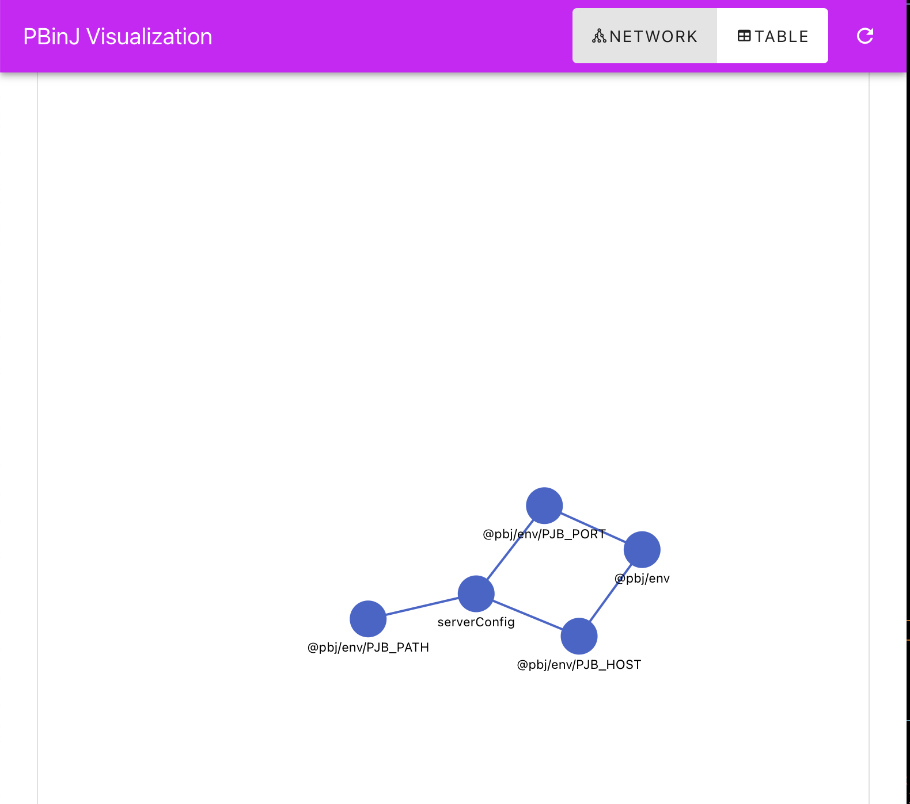
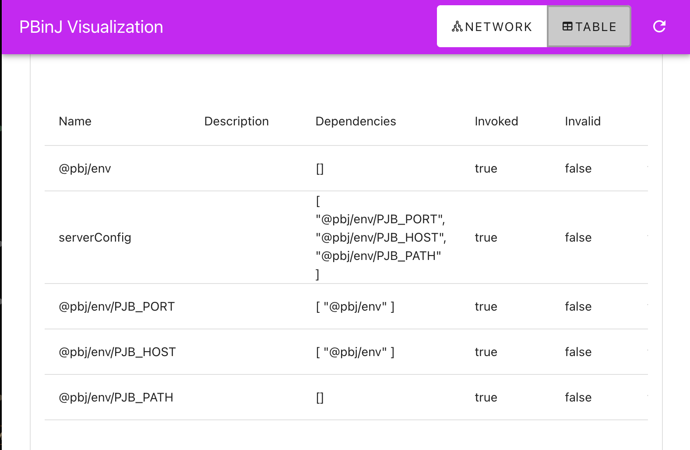

# Visualization

PBinJ includes a built-in visualization tool that helps you understand and debug your dependency injection container. It provides both network graph and table views of your services and their relationships.




## Installation

```bash
npm install @pbinj/pbj-visualization
```

```bash
pnpm add @pbinj/pbj-visualization
```

```bash
yarn add @pbinj/pbj-visualization
```

## Quick Start

Use the pbj-visualization script to launch your app.
```bash
$ pbj-visualization ./path/to/your/pea.ts
```

Or for more control embed it into your app.

```typescript
import { register } from "@pbinj/pbj-visualization";

register(app);
```

By default, this will:
- Start the visualization server on port 3000 (configurable)
- Expose the visualization UI at `/pbj`
- Provide real-time updates of your dependency graph

## Configuration

You can customize the visualization settings using environment variables:

```bash
# Server configuration
PBJ_PORT=3000        # Port for the visualization server
PBJ_HOST=localhost   # Host for the visualization server
PBJ_PATH=/pbj        # Base path for the visualization UI
```

Or programmatically:

```typescript
import { register, VisualizationConfig, visualizationConfigKey } from "@pbinj/pbj-visualization";
import { context } from "@pbinj/pbj";

context.register(visualizationConfigKey,  new VisualizationConfig(4000, "0.0.0.0", "/debug"));
register(context);

```

### Network View

The network view displays your dependencies as an interactive graph:
- Nodes represent services
- Edges show dependencies between services
- Hover over nodes to see service details
- Drag nodes to rearrange the layout
- Zoom and pan to explore large graphs

### Table View

The table view provides a detailed list of all services:
- Service name and type
- Dependencies and dependents
- Registration status
- Lifecycle information

### Log View
Shows the PBinJ logs in real time.   

## Examples

### Basic Setup

```typescript
import express from "express";
import { apply } from "@pbinj/pbj-visualization";
import { context } from "@pbinj/pbj";

const app = express();

// Register some services
class UserService {
  constructor(private db = pbj(DatabaseService)) {}
}

class AuthService {
  constructor(private users = pbj(UserService)) {}
}

context.register(DatabaseService);
context.register(UserService);
context.register(AuthService);

// Add visualization
apply(app);

app.listen(3000);
```


## Best Practices

1. **Development Only**
   Consider enabling visualization only in development:

   ```typescript
   if (process.env.NODE_ENV === "development") {
     register(app);
   }
   ```


## Troubleshooting

### Common Issues

1. **Visualization Not Loading**
   - Check if the server is running on the correct port
   - Verify network access to the visualization endpoint
   - Check browser console for errors

2. **Missing Dependencies**
   - Ensure all services are properly registered
   - Check for circular dependencies
   - Verify import paths

3. **Performance Issues**
   - Reduce update frequency
   - Filter unnecessary services
   - Consider using the table view for large graphs
